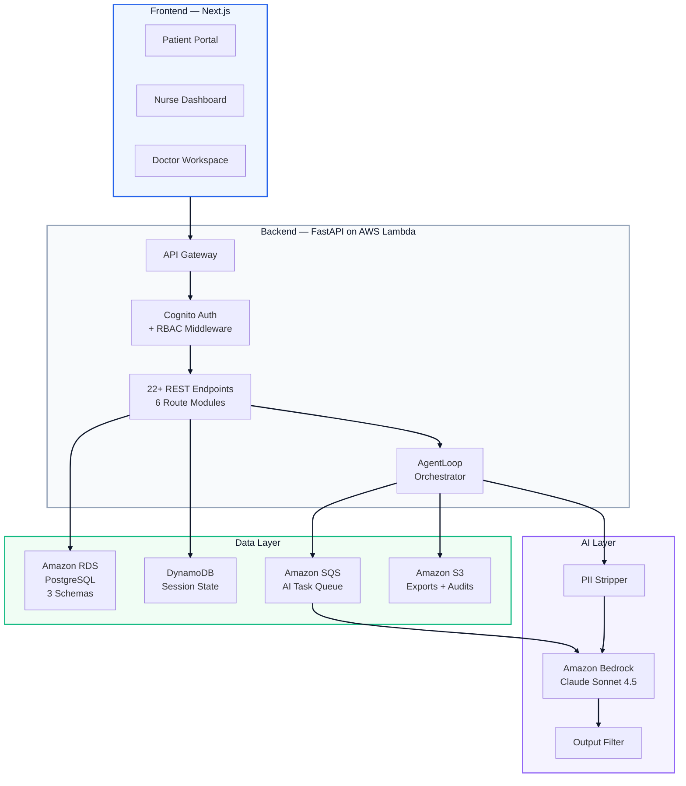

  

   

  ### **The Next Generation of Clinical Workflow Intelligence**
  *Bridging the gap between fragmented patient data and AI-assisted clinical excellence.*

   

  
  
  
  
  

   

  ---

  **Replacing fragmented clinic paperwork with an intelligent, role-based clinical workflow.**
  *Digital consent, adaptive intake, nurse vitals capture, AI differential diagnosis synthesis, and doctor sign-off — all in one secure system.*

   

 

## What We're Building

AarogyamAI is an end-to-end clinical workflow platform powered by **Claude on Amazon Bedrock**. It unifies the entire patient journey — digital consent, adaptive intake questionnaire, nurse vitals capture, AI differential diagnosis synthesis, and doctor sign-off — into one secure, auditable system.

No more paper forms. No more disconnected systems. No more manual SOAP note writing.

Recent updates include **real patient OTP login (JWT session)**, a **text-only conversational intake assistant**, **LLM-based nurse handoff summaries**, and a **live nurse dashboard** with vitals capture and status management.

 

## The Problem

A typical clinic visit involves 4–6 disconnected steps across different tools — paper consent forms, verbal intake, manual vitals entry, handwritten notes, and separate EHR systems. This creates delays, errors, and no audit trail. Doctors spend 30–40% of their time on documentation instead of patients.

 

## Live Demo

🚀 **Link:** [https://aarogyam-ai-frontend.vercel.app](https://aarogyam-ai-frontend.vercel.app)

All features working including AI nurse intake, differential diagnosis, and real-time chat.

### Test Credentials

| Role | Email | Password |
|---|---|---|
| **Patient** | `patient@test.com` | `admin123` |
| **Nurse** | `nurse@test.com` | `admin123` |
| **Doctor** | `doctor@test.com` | `admin123` |
| **Admin** | `admin@hospital.com` | `admin123` |

> **Note:** This is a hackathon demo instance. For production use, credentials will be securely managed through AWS Cognito

 

## How It Works

```mermaid
flowchart LR
    A["🧑 Patient<br/>Consent + Intake<br/>Questionnaire"] -->|"Encrypted<br/>Session"| B["👩‍⚕️ Nurse<br/>Vitals Capture<br/>+ Observation"]
    B -->|"SQS<br/>Job Fire"| C["⚡ AgentLoop<br/>AI Orchestrator"]
    C -->|"Claude on<br/>Bedrock"| D["🤖 AI Synthesis<br/>Differential<br/>Diagnosis"]
    D -->|"Review<br/>Interface"| E["👨‍⚕️ Doctor<br/>Accept / Modify<br/>+ Commit"]
    E -->|"Audit<br/>Chain"| F["📋 Signed<br/>Medical Record<br/>+ S3 Export"]

    style A fill:#EFF6FF,stroke:#2563EB,color:#1e40af
    style B fill:#EEF2FF,stroke:#4F46E5,color:#3730a3
    style C fill:#0F172A,stroke:#334155,color:#94a3b8
    style D fill:#0F172A,stroke:#334155,color:#94a3b8
    style E fill:#EFF6FF,stroke:#2563EB,color:#1e40af
    style F fill:#F0FDF4,stroke:#10B981,color:#065f46
```

 

## Architecture

## Tech Stack

| Layer | Technology |
|---|---|
| **Frontend** | Next.js 14, TypeScript, Framer Motion |
| **Backend** | FastAPI, Python, SQLAlchemy, Alembic |
| **AI Model** | Claude Sonnet 4.5 via Amazon Bedrock |
| **AI Providers** | AWS Bedrock (primary) + OpenAI (fallback) |
| **Auth** | Amazon Cognito (staff JWT) + real patient OTP/JWT flow |
| **Database** | Amazon RDS PostgreSQL (3-schema design) |
| **Queue** | Amazon SQS + AWS Lambda workers (doctor synthesis handoff) |
| **Storage** | Amazon S3 (exports, audit archives) + local fallback |
| **Audit** | DynamoDB + PostgreSQL dual-write with fallback |
| **Observability** | Amazon CloudWatch, structured JSON logs |
| **Compliance** | DPDP-compliant consent, hash-chain audit trail |

 

## Key Features

**Patient Portal**
- Conversational AI intake assistant with natural chat interface
- Real OTP-based authentication with JWT sessions
- Complete medical history with doctor diagnosis and treatment plans

**Nurse Dashboard**
- Live patient queue with priority management
- Vitals capture with previous history display
- Mark patients ready for doctor review

**Doctor Workspace**
- AI-powered differential diagnosis suggestions
- Clinical reasoning documentation with treatment plans
- Patient history review with complete encounter details

**System Capabilities**
- Hybrid AI (AWS Bedrock + OpenAI fallback)
- Dual storage (S3 + local fallback)
- Dual audit logging (DynamoDB + PostgreSQL)
- Role-based access control with DPDP-compliant consent

 