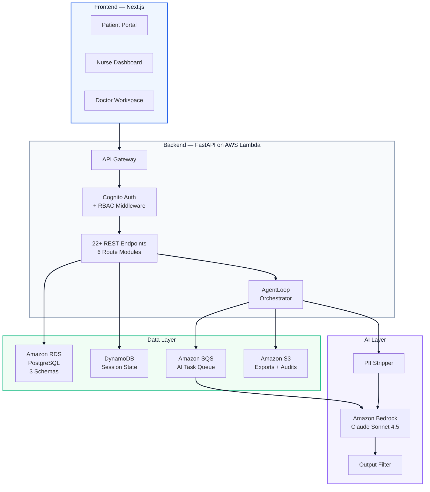

# 🏥 AarogyamAI — Clinical AI Workflow Platform

> **Replacing fragmented clinic paperwork with an intelligent, role-based clinical workflow — from patient intake to AI-assisted diagnosis to signed medical records.**

<br/>

## What We're Building

AarogyamAI is an end-to-end clinical workflow platform powered by **Claude on Amazon Bedrock**. It unifies the entire patient journey — digital consent, adaptive intake questionnaire, nurse vitals capture, AI differential diagnosis synthesis, and doctor sign-off — into one secure, auditable system.

No more paper forms. No more disconnected systems. No more manual SOAP note writing.

<br/>

## The Problem

A typical clinic visit involves 4–6 disconnected steps across different tools — paper consent forms, verbal intake, manual vitals entry, handwritten notes, and separate EHR systems. This creates delays, errors, and no audit trail. Doctors spend 30–40% of their time on documentation instead of patients.

<br/>

## How It Works

```mermaid
flowchart LR
    A["🧑 Patient<br/>Consent + Intake<br/>Questionnaire"] -->|"Encrypted<br/>Session"| B["👩‍⚕️ Nurse<br/>Vitals Capture<br/>+ Observation"]
    B -->|"SQS<br/>Job Fire"| C["⚡ AgentLoop<br/>AI Orchestrator"]
    C -->|"Claude on<br/>Bedrock"| D["🤖 AI Synthesis<br/>Differential<br/>Diagnosis"]
    D -->|"Review<br/>Interface"| E["👨‍⚕️ Doctor<br/>Accept / Modify<br/>+ Commit"]
    E -->|"Audit<br/>Chain"| F["📋 Signed<br/>Medical Record<br/>+ S3 Export"]

    style A fill:#EFF6FF,stroke:#2563EB,color:#1e40af
    style B fill:#EEF2FF,stroke:#4F46E5,color:#3730a3
    style C fill:#0F172A,stroke:#334155,color:#94a3b8
    style D fill:#0F172A,stroke:#334155,color:#94a3b8
    style E fill:#EFF6FF,stroke:#2563EB,color:#1e40af
    style F fill:#F0FDF4,stroke:#10B981,color:#065f46
```



<br/>

## Architecture



## Tech Stack

| Layer | Technology |
|---|---|
| **Frontend** | Next.js 14, TypeScript, Framer Motion |
| **Backend** | FastAPI, Python, SQLAlchemy, Alembic |
| **AI Model** | Claude Sonnet 4.5 via Amazon Bedrock |
| **Auth** | Amazon Cognito (staff JWT + patient OTP) |
| **Database** | Amazon RDS PostgreSQL (3-schema design) |
| **Queue** | Amazon SQS + AWS Lambda workers |
| **Storage** | Amazon S3 (exports, audit archives) |
| **Observability** | Amazon CloudWatch, structured JSON logs |
| **Compliance** | DPDP-compliant consent, hash-chain audit trail |

<br/>

## Key Features

- **Role-Based Access** — Separate, secure workspaces for Patients, Nurses, and Doctors
- **Adaptive Intake** — AI-guided questionnaire that adjusts based on patient responses
- **AI Differential Diagnosis** — Claude synthesizes vitals + history into ranked clinical hypotheses with confidence scores
- **Doctor Review Interface** — Accept, modify, or reject AI suggestions before committing to record
- **Hash-Chain Audit Trail** — Every action is tamper-proof and auditable
- **DPDP Consent Engine** — Tiered consent (Tier 1: general care, Tier 2: AI synthesis) with full withdrawal support
- **Fallback Safety** — If AI fails, structured manual form activates automatically

<br/>

## Project Structure

```
AarogyamAI/
├── clinical-ai/
│   ├── api/
│   │   ├── routes/          # 6 route modules (patient, nurse, doctor, admin, consent, rights)
│   │   ├── services/        # Business logic layer
│   │   ├── models/          # SQLAlchemy DB models
│   │   ├── schemas/         # Pydantic request/response schemas
│   │   └── middleware/      # Auth, RBAC, consent, audit, input validation
│   ├── agent/
│   │   ├── agent_loop.py    # Central AI orchestrator
│   │   ├── tools/           # Atomic AI tools (PII strip, output filter, context builder)
│   │   └── skills/          # Composed clinical workflows
│   ├── tests/               # 92+ unit + integration tests
│   ├── scripts/             # Seed, prototype flow, observability check
│   └── frontend/            # Next.js — 13 screens across 3 roles
└── README.md
```

<br/>

## Current Status

| Area | Status |
|---|---|
| Backend API | ✅ 22+ endpoints live |
| Database Schema | ✅ 3-schema PostgreSQL, migrations ready |
| AgentLoop / AI Core | ✅ Built with PII stripping + fallback |
| Auth + RBAC + Consent | ✅ Full middleware stack |
| Unit Tests | ✅ 92+ passing |
| Frontend — Login | ✅ Built |
| Frontend — All screens | 🔄 In progress (13 screens designed) |
| AWS Deployment | 🔄 Pending credits |

<br/>

## Live Demo

> Coming soon 